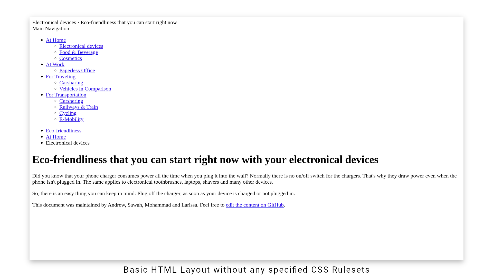

# CSS (Cascading Style Sheets)

Besides HTML files most websites use CSS files to maintain the styling.
HTML structures the content of a website and CSS styles them.

The way CSS works is quite easy, if you understand the method behind it.
CSS uses rulesets to address curtain HTML elements in specific context.
This means you are styling HTML elements in general, rather than adapting a specific styling to every single HTML element.

**Note:** *If you are not familiar with the HTML syntax yet, reading the [WCC-HTML](./../WCC-HTML) could be a nice introduction for you.*

## Basic HTML Layout without Stylings

To be able to style something we will need some content.
We have prepared a basic layout with all kind of different HTML elements.
Feel free to use it in an [online code editor like CodePen](https://codepen.io/dailysh-it/pen/gOYZXQX) or copy it to your local development environment.
If you are not using an IDE (Integrated Development Environment) yet, have a look on our [list of IDE's](WCC-Glossary#ide-integrated-development-environment).

<details>
  <summary>See the code example of a Basic HTML layout</summary>
    
  ```html
  <!DOCTYPE html>
  <html>

    <!-- Machine readable information comes here -->
    <head>
      <title>Eco-friendliness that you can start right now</title>
    </head>

    <!-- Displayed content in the browser -->
    <body>

      <!-- Title of your website -->
      <header>
        <span>Electronical devices</span> · Eco-friendliness that you can start right now
      </header>
    
      <div>
        <!-- Navigation through your Website -->
        <section>
          <!-- Title of the Navigation -->
          <header>
            Main Navigation
          </header>
          <nav>
            <!-- Link list of all Navigation Points -->
            <ul>
              <li>
                <a href="#">At Home</a>
                <!-- Sub Navigation -->
                <ul>
                  <li>
                    <a href="#">Electronical devices</a>
                  </li>
                  <li>
                    <a href="#">Food & Beverage</a>
                  </li>
                  <li>
                    <a href="#">Cosmetics</a>
                  </li>
                </ul>
              </li>
              <li>
                <a href="#">At Work</a>
                <!-- Sub Navigation -->
                <ul>
                  <li>
                    <a href="#">Paperless Office</a>
                  </li>
                </ul>
              </li>
              <li>
                <a href="#">For Traveling</a>
                <!-- Sub Navigation -->
                <ul>
                  <li>
                    <a href="#">Carsharing</a>
                  </li>
                  <li>
                    <a href="#">Vehicles in Comparison</a>
                  </li>
                </ul>
              </li>
              <li>
                <a href="#">For Transportation</a>
                <!-- Sub Navigation -->
                <ul>
                  <li>
                    <a href="#">Carsharing</a>
                  </li>
                  <li>
                    <a href="#">Railways & Train</a>
                  </li>
                  <li>
                    <a href="#">Cycling</a>
                  </li>
                  <li>
                    <a href="#">E-Mobility</a>
                  </li>
                </ul>
              </li>
            </ul>
          </nav>
        </section>

        <main>

          <nav>
            <ul>
              <li>
                <a href="#">Eco-friendliness</a>
              </li>
              <li>
                <a href="#">At Home</a>
              </li>
              <li>Electronical devices</li>
            </ul>
          </nav>

          <h1>Eco-friendliness that you can start right now with your electronical devices</h1>
          <p>
            Did you know that your phone charger consumes power all the time when you plug it into the wall?
            Normally there is no on/off switch for the chargers.
            That's why they draw power even when the phone isn't plugged in.
            The same applies to electronical toothbrushes, laptops, shavers and many other devices.
          </p>
          <p>
            So, there is an easy thing you can keep in mind: Plug off the charger, as soon as your device is charged or not plugged in.
          </p>
          <footer>
            This document was maintained by Andrew, Sawah, Mohammad and Larissa.
            Feel free to <a href="#">edit the content on GitHub</a>.
          </footer>

        </main>
      </div>

    </body>
  </html>
  ```
</details>


<div align="center">
  <small><i>Basic HTML Layout without any specified CSS Rulesets</i></small>
</div>
<br><br>

## Basic HTML Layout with CSS Classes and Stylings

https://codepen.io/dailysh-it/pen/jONXpqZ

<details>
  <summary>See the code example of the Final HTML+CSS Classes Layout</summary>
    
  ```html
  <!DOCTYPE html>
  <html>
    <head>
      <title>Eco-friendliness that you can start right now</title>
    </head>
    <body>
      <header>
        <span>Electronical devices</span> · Eco-friendliness that you can start right now
      </header>
      <section>
        <header>
          Main Navigation
        </header>
        <nav>
          <ul>
            <li>
              <a href="#">At Home</a>
              <ul>
                <li>
                  <a href="#">Electronical devices</a>
                </li>
                <li>
                  <a href="#">Food & Beverage</a>
                </li>
                 <li>
                  <a href="#">Cosmetics</a>
                </li>
              </ul>
            </li>
            <li>
              <a href="#">At Work</a>
              <ul>
                <li>
                  <a href="#">Paperless Office</a>
                </li>
              </ul>
            </li>
            <li>
              <a href="#">For Traveling</a>
              <ul>
                <li>
                  <a href="#">Carsharing</a>
                </li>
                <li>
                  <a href="#">Vehicles in Comparison</a>
                </li>
              </ul>
            </li>
            <li>
              <a href="#">For Transportation</a>
              <ul>
                <li>
                  <a href="#">Carsharing</a>
                </li>
                <li>
                  <a href="#">Railways & Train</a>
                </li>
                <li>
                  <a href="#">Cycling</a>
                </li>
                <li>
                  <a href="#">E-Mobility</a>
                </li>
              </ul>
            </li>
          </ul>
        </nav>
      </section>

      <main>

        <nav>
          <ul>
            <li>
              <a href="#">Eco-friendliness</a>
            </li>
            <li>
              <a href="#">At Home</a>
            </li>
            <li>Electronical devices</li>
          </ul>
        </nav>

        <h1>Eco-friendliness that you can start right now with your electronical devices</h1>
        <p>
          Did you know that your phone charger consumes power all the time when you plug it into the wall?
          Normally there is no on/off switch for the chargers.
          That's why they draw power even when the phone isn't plugged in.
          The same applies to electronical toothbrushes, laptops, shavers and many other devices.
        </p>
        <p>
          So, there is an easy thing you can keep in mind: Plug off the charger, as soon as your device is charged or not plugged in.
        </p>
        <footer>
          This document was maintained by Andrew, Sawah, Mohammad and Larissa.
          Feel free to <a href="#">edit the content on GitHub</a>.
        </footer>

      </main>

    </body>
  </html>
  ```
</details>
