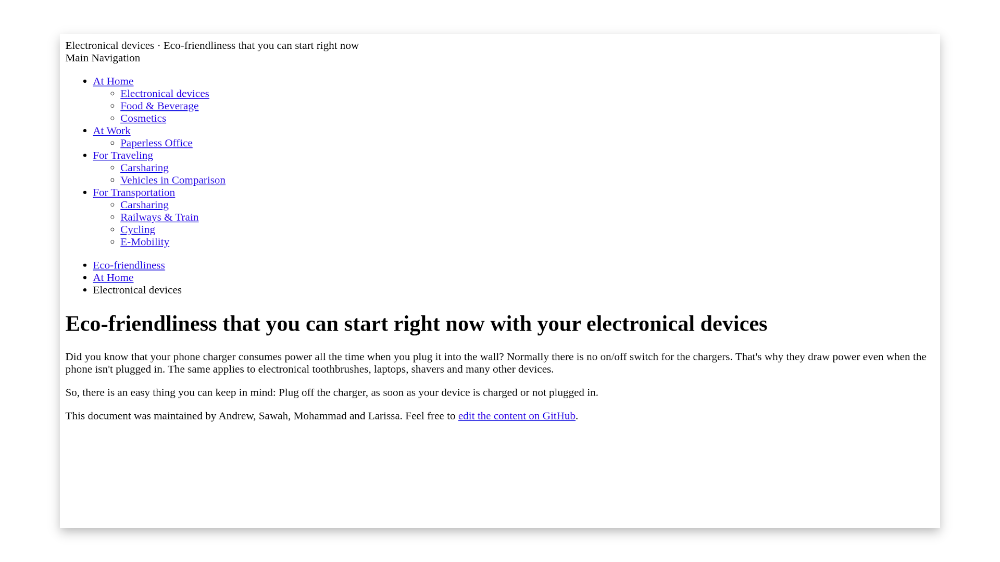
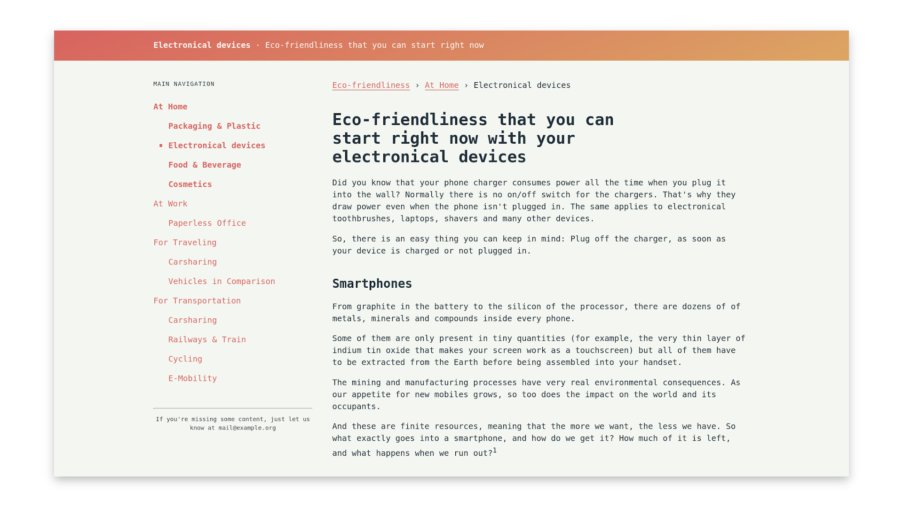

# CSS (Cascading Style Sheets)

Besides HTML files most websites use CSS files to maintain the styling.
HTML structures the content of a website and CSS styles them.

The way CSS works is quite easy, if you understand the method behind it.
CSS uses rulesets to address curtain HTML elements in specific context.
This means you are styling HTML elements in general, rather than adapting a specific styling to every single HTML element.

**Note:** *If you are not familiar with the HTML syntax yet, reading the [WCC-HTML](./../WCC-HTML) could be a nice introduction for you.*

## Basic HTML Layout without Stylings

To be able to style something we will need some content.
We have prepared a basic layout with all kind of different HTML elements.
Feel free to use it in an [online code editor like CodePen](https://codepen.io/dailysh-it/pen/gOYZXQX) or copy it to your local development environment.
If you are not using an IDE (Integrated Development Environment) yet, have a look on our [list of IDE's](WCC-Glossary#ide-integrated-development-environment).

<details>
  <summary>See the code example of a Basic HTML layout</summary>
    
  ```html
  <!DOCTYPE html>
  <html>

    <!-- Machine readable information comes here -->
    <head>
      <title>Eco-friendliness that you can start right now</title>
    </head>

    <!-- Displayed content in the browser -->
    <body>

      <!-- Title of your website -->
      <header>
        <span>Electronical devices</span> · Eco-friendliness that you can start right now
      </header>
    
      <div>
        <!-- Navigation through your Website -->
        <section>
          <!-- Title of the Navigation -->
          <header>
            Main Navigation
          </header>
          <nav>
            <!-- Link list of all Navigation Points -->
            <ul>
              <li>
                <a href="#">At Home</a>
                <!-- Sub Navigation -->
                <ul>
                  <li>
                    <a href="#">Electronical devices</a>
                  </li>
                  <li>
                    <a href="#">Food & Beverage</a>
                  </li>
                  <li>
                    <a href="#">Cosmetics</a>
                  </li>
                </ul>
              </li>
              <li>
                <a href="#">At Work</a>
                <!-- Sub Navigation -->
                <ul>
                  <li>
                    <a href="#">Paperless Office</a>
                  </li>
                </ul>
              </li>
              <li>
                <a href="#">For Traveling</a>
                <!-- Sub Navigation -->
                <ul>
                  <li>
                    <a href="#">Carsharing</a>
                  </li>
                  <li>
                    <a href="#">Vehicles in Comparison</a>
                  </li>
                </ul>
              </li>
              <li>
                <a href="#">For Transportation</a>
                <!-- Sub Navigation -->
                <ul>
                  <li>
                    <a href="#">Carsharing</a>
                  </li>
                  <li>
                    <a href="#">Railways & Train</a>
                  </li>
                  <li>
                    <a href="#">Cycling</a>
                  </li>
                  <li>
                    <a href="#">E-Mobility</a>
                  </li>
                </ul>
              </li>
            </ul>
          </nav>
        </section>

        <main>

          <nav>
            <ul>
              <li>
                <a href="#">Eco-friendliness</a>
              </li>
              <li>
                <a href="#">At Home</a>
              </li>
              <li>Electronical devices</li>
            </ul>
          </nav>

          <h1>Eco-friendliness that you can start right now with your electronical devices</h1>
          <p>
            Did you know that your phone charger consumes power all the time when you plug it into the wall?
            Normally there is no on/off switch for the chargers.
            That's why they draw power even when the phone isn't plugged in.
            The same applies to electronical toothbrushes, laptops, shavers and many other devices.
          </p>
          <p>
            So, there is an easy thing you can keep in mind: Plug off the charger, as soon as your device is charged or not plugged in.
          </p>
          <footer>
            This document was maintained by Andrew, Sawah, Mohammad and Larissa.
            Feel free to <a href="#">edit the content on GitHub</a>.
          </footer>

        </main>
      </div>

    </body>
  </html>
  ```
</details>


<div align="center">
  <small><i>Basic HTML Layout without any specified CSS Rulesets</i></small>
</div>
<br><br>

## Final HTML Layout with CSS Classes and Rulesets


<div align="center">
  <small><i>Final HTML Layout with CSS Classes CSS Rulesets</i></small>
</div>
<br><br>

https://codepen.io/dailysh-it/pen/jONXpqZ?editors=1100

<details>
  <summary>See the code example of the final CSS rulesets</summary>

  ```css
  /**
  * CONTENTS
  *
  * BASE
  * Resets...............Resetting HTML and BODY
  * Anchors..............Links in general and with external targets
  * Paragraphs...........Text, font and positioning
  * Headings.............H1–H2 styles
  * Ordered Lists........
  *
  * HELPERS
  * Container............Wrapping and constraining elements
  * Flex.................Flexbox support
  * Lists................Arranging lists in different orientation
  *
  * COMPONENTS
  * Page-head............The main page header
  * Page-menu............The main page navigation
  * Page-main............The main page content
  * Page-footer..........The main page footer
  * Breadcrumb...........The main page footer
  *
  * TRUMPS
  * Text.................Text helpers
  */
  /*---------------------------------------------------------------------------*\
    #BASE
  \*---------------------------------------------------------------------------*/
  body,
  html {
    margin: 0;
    padding: 0;
  }

  body {
    background: #f3f7f0;
    color: #19323c;
    font-family: monospace;
    font-size: 1rem;
  }

  a {
    color: #f2545b;
    text-decoration: none;
    border-bottom: 1px solid transparent;
    transition: all 120ms ease-in;
  }

  a:hover, a:focus {
    border-color: #f58287;
  }

  a[href^="http"]:after {
    content: " →";
  }

  h1,
  h2,
  h3,
  h4 {
    max-width: 80%;
    margin-top: 2rem;
  }

  p {
    line-height: 150%;
  }

  ol li {
    margin-bottom: 0.5rem;
  }

  /*---------------------------------------------------------------------------*\
    #HELPERS
  \*---------------------------------------------------------------------------*/
  .container {
    max-width: 60rem;
    margin: 0 auto;
    padding: 0 1rem;
  }

  /**
  * The flex class is supposed to be used in two different orientations:
  * 
  * 1. Rows (by default)
  * 2. Columns
  * 
  * Regardless of the orientation every flex child has a specified gap to the
  * next element. Therefore the wrapper class `.flex` has to be margined by a 
  * corresponding *negative* value.
  */
  .flex {
    display: flex;
    /* [1] */
    flex-flow: row;
    margin: 0 -0.5rem;
    /* [2] */
  }

  .flex--column {
    flex-flow: column;
  }

  .flex__item {
    padding: 0 0.5rem;
  }

  /**
  * Lists are in general unstyled and come in two different orientations:
  * 
  * 1. Vertical (by default)
  * 2. Horizontal
  * 
  * Most lists will have links inside, so the links are styled without
  * any other class.
  */
  .list {
    display: flex;
    /* [1] */
    flex-flow: column;
    margin: 0;
    padding: 0;
    /* [2] */
  }

  .list__item {
    list-style-type: none;
    white-space: nowrap;
  }

  .list__item a {
    display: block;
  }

  .list__item a:hover, .list__item a:focus {
    color: #f58287;
  }

  .list--horizontal {
    flex-flow: row;
  }

  .list--horizontal .list__item {
    display: flex;
  }

  .list--horizontal .list__item:not(:nth-child(1)):before {
    content: "›";
    display: inline-block;
    margin: 0 0.5rem;
  }

  .list--menu .list__item a {
    border: none;
    padding: 0.5rem 0;
  }

  .list--menu .list__item.list__item--active {
    font-weight: bold;
  }

  .list--sub-menu {
    margin-left: 1.5rem;
  }

  .list--sub-menu .list__item.list__item--active a:before {
    opacity: 1;
    transform: scale(2);
  }

  .list--sub-menu .list__item a {
    position: relative;
  }

  .list--sub-menu .list__item a:before {
    position: absolute;
    left: -1rem;
    content: "·";
    opacity: 0;
    transition: all 120ms ease-in;
  }

  .list--sub-menu .list__item a:hover:before, .list--sub-menu .list__item a:focus:before {
    opacity: 1;
    transform: scale(2);
  }

  /*---------------------------------------------------------------------------*\
    #COMPONENTS
  \*---------------------------------------------------------------------------*/
  .page-head {
    margin-bottom: 2rem;
    background: #f2545b;
    background-image: linear-gradient(160deg, #f2545b, #eda257);
    color: #f9fbf8;
  }

  .page-head__link {
    display: block;
    padding: 1rem 0;
    color: #f9fbf8;
  }

  .page-head__link:hover, .page-head__link:focus {
    opacity: 0.75;
  }

  .page-head span {
    font-weight: bold;
  }

  .page-menu {
    min-width: 16rem;
    margin-right: 1rem;
  }

  .page-menu__title {
    font-size: 0.6rem;
    text-transform: uppercase;
    letter-spacing: 0.05rem;
    margin-bottom: 1rem;
  }

  .page-menu__list {
    margin: 1rem 0 2rem;
  }

  .page-main__footer {
    margin: 2rem 0;
    padding: 0.5rem 0;
    opacity: 0.75;
    border-top: 1px solid #19323c;
    font-size: 0.6rem;
  }

  .page-main a {
    font-weight: bold;
  }

  .breadcrumb a {
    border-bottom: 1px solid #f58287;
    font-weight: normal;
  }

  /*---------------------------------------------------------------------------*\
    #TRUMPS
  \*---------------------------------------------------------------------------*/
  .text--small {
    font-size: 0.6rem !important;
  }

  .text--center {
    text-align: center !important;
  }

  .text--gray {
    color: #303e44 !important;
  }

  ```
</details>

<details>
  <summary>See the code example of the final HTML+CSS Classes Layout</summary>
    
  ```html
  <!DOCTYPE html>
  <html>
    <head>
      <title>Eco-friendliness that you can start right now</title>
      <link rel="stylesheet" href="styles.css" />
    </head>
    <body>
      <header class="page-head">
        <div class="container">
          <a href="#" title="Go back to Homepage" class="page-head__link">
            <span>Electronical devices</span> · Eco-friendliness that you can start right now
          </a>
        </div>
      </header>

      <div class="container">
        <div class="flex flex--row">
          <section class="page-menu flex__item">
            <header class="page-menu__title">
              Main Navigation
            </header>
            <nav class="page-menu__list">
              <ul class="list list--menu">
                <li class="list__item list__item--active">
                  <a href="#">At Home</a>
                  <ul class="list list--sub-menu">
                    <li class="list__item">
                      <a href="#">Packaging & Plastic</a>
                    </li>
                    <li class="list__item list__item--active">
                      <a href="#">Electronical devices</a>
                    </li>
                    <li class="list__item">
                      <a href="#">Food & Beverage</a>
                    </li>
                    <li class="list__item">
                      <a href="#">Cosmetics</a>
                    </li>
                  </ul>
                </li>
                <li class="list__item">
                  <a href="#">At Work</a>
                  <ul class="list list--sub-menu">
                    <li class="list__item">
                      <a href="#">Paperless Office</a>
                    </li>
                  </ul>
                </li>
                <li class="list__item">
                  <a href="#">For Traveling</a>
                  <ul class="list list--sub-menu">
                    <li class="list__item">
                      <a href="#">Carsharing</a>
                    </li>
                    <li class="list__item">
                      <a href="#">Vehicles in Comparison</a>
                    </li>
                  </ul>
                </li>
                <li class="list__item">
                  <a href="#">For Transportation</a>
                  <ul class="list list--sub-menu">
                    <li class="list__item">
                      <a href="#">Carsharing</a>
                    </li>
                    <li class="list__item">
                      <a href="#">Railways & Train</a>
                    </li>
                    <li class="list__item">
                      <a href="#">Cycling</a>
                    </li>
                    <li class="list__item">
                      <a href="#">E-Mobility</a>
                    </li>
                  </ul>
                </li>
              </ul>
            </nav>
            <div>
              <hr/>
              <p class="text--small text--center text--gray">If you're missing some content, just let us know at mail@example.org</p>
            </div>
          </section>

          <main class="page-main flex__item">
            <nav class="breadcrumb">
              <ul class="list list--horizontal list--breadcrumb">
                <li class="list__item">
                  <a href="#">Eco-friendliness</a>
                </li>
                <li class="list__item">
                  <a href="#">At Home</a>
                </li>
                <li class="list__item">
                  Electronical devices
                </li>
              </ul>
            </nav>

            <h1>
              Eco-friendliness that you can start right now with your electronical
              devices
            </h1>
            <p>
              Did you know that your phone charger consumes power all the time
              when you plug it into the wall? Normally there is no on/off switch
              for the chargers. That's why they draw power even when the phone
              isn't plugged in. The same applies to electronical toothbrushes,
              laptops, shavers and many other devices.
            </p>
            <p>
              So, there is an easy thing you can keep in mind: Plug off the
              charger, as soon as your device is charged or not plugged in.
            </p>

            <h2>Smartphones</h2>

            <p>
              From graphite in the battery to the silicon of the processor, there are dozens of of metals, minerals and compounds inside every phone.
            </p>
            <p>
              Some of them are only present in tiny quantities (for example, the very thin layer of indium tin oxide that makes your screen work as a touchscreen) but all of them have to be extracted from the Earth before being assembled into your handset.
            </p>
            <p>
              The mining and manufacturing processes have very real environmental consequences. As our appetite for new mobiles grows, so too does the impact on the world and its occupants.
            </p>
            <p>
              And these are finite resources, meaning that the more we want, the less we have. So what exactly goes into a smartphone, and how do we get it? How much of it is left, and what happens when we run out?<sup>1</sup>
            </p>

            <h3>Buying New Smartphones</h3>

            <h4>Shiftphone (Germany)</h4>
            <p>
              As a small family business without investors, we have a clear goal: to do as much good as we can while causing as little damage as possible. We take this very seriously and implement it consistently and optimally. We take no personal profits and the budget for advertising and marketing is less than 0.1 percent and therefore not listed here.<sup>2</sup>
            </p>
            <p>
              <a href="https://www.shiftphones.com/">Buy new mobile phones from Shiftphone</a>
            </p>

            <h4>FAIRPHONE</h4>

            <p>
              Consumer electronics are often viewed as semi-disposable objects, to be upgraded or discarded as soon as something better comes along. We’re fighting against a market trend where the average phone is replaced every 24 months, creating a huge environmental impact. As technology advances rapidly, consumers are losing the ability to repair, and truly understand how they can keep their devices longer.
            </p>
            <p>
              It shouldn’t have to be so complicated. That’s why we created the first modular phone. If an accident happens, just replace the screen and not the whole phone. We’re also working on making software that can be supported for over 5 years. This way, our core value of longevity is designed directly into our smartphones.<sup>3</sup>
            </p>

            <h3>Recycling old Smartphones</h3>

            <p>
              Instead of investing in expensice new phones buying used ones will safe you money as well as ressources.
            </p>

            <h4>reBuy (Germany)</h4>

            <p>
              Purchase and sale for used mobile phones, tablets, video games, movies, CDs, books, and more at reBuy. Buy and sell used phones safely and quickly.<sup>4</sup>
            </p>
            <p>
              <a href="https://www.rebuy.de/">Buy used mobile phones on reBuy</a>
            </p>

            <h4>Swappa</h4>

            <p>
              Sell your phone safely on Swappa and get paid fast! On Swappa you buy and sell directly with other users and cutting out the middleman means more cash in your pocket. Plus, our PayPal-based system gives you and the buyer strong protection. All carriers, including unlocked, Verizon, AT&T, T-Mobile and Sprint.<sup>5</sup>
            </p>
            <p>
              <a href="https://swappa.com/sell/phone">Buy used mobile phones on Swappa</a>
            </p>

            <footer class="page-main__footer">
              Sources:
              <ol>
                <li>https://www.techradar.com/news/phone-and-communications/mobile-phones/our-smartphone-addiction-is-costing-the-earth-1299378</li>
                <li>Translated from https://www.shiftphones.com/</li>
                <li>Translated from https://www.rebuy.de/</li>
                <li>https://swappa.com/sell/phone</li>
              </ol>
            </footer>
          </main>
        </div>
      </div>
    </body>
  </html>

  ```
</details>
