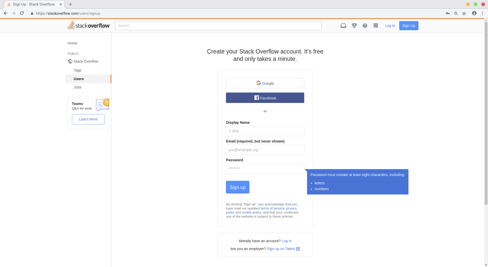
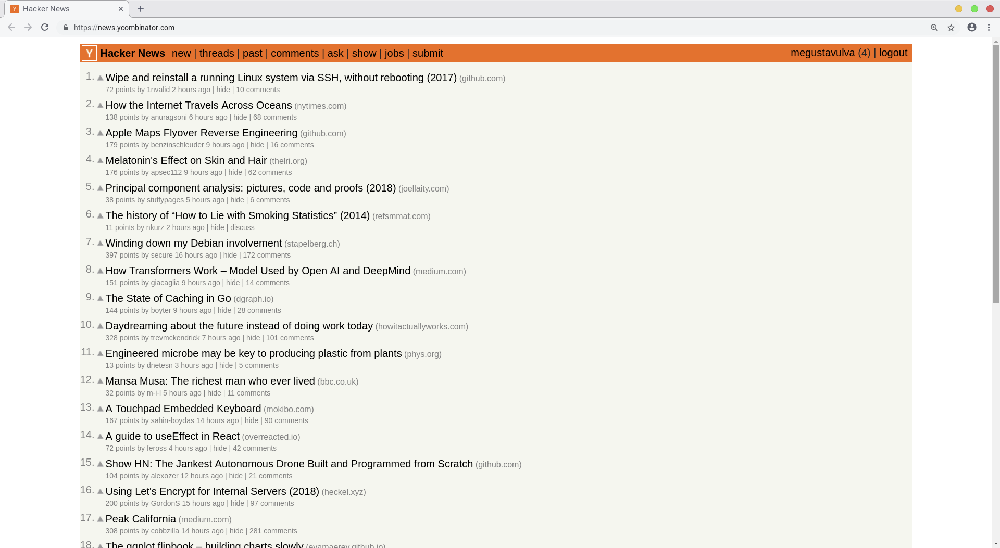

# WCC Session 1

Welcome to the first Web Coding Class Session. 
If you're a total beginner and want to start coding, you'll find here much introductional information on how the Internet works, what happens in the background of your browser while you're browsing the web etc.
There is a huge demand on good web developers.
What basically is meant by „good” we will explain on a later session.
But, don't worry and go ahead or skip different sections or even whole session.

## Website Manipulation

> It's all visible.

Websites are simply programs, that run on servers (*many stacked computers, that are „always“ reachable in the web*) and can be opened by any web browser.
If you buy any program out their, except it's open source, you won't be able to look what's going up inside.
It's like buying a smartphone or laptop without any simple possibility to change the battery.
But websites are different, because a huge part of it's code is directly accessable.
So, you can have a close look on what's going up in there.

Let's make an example from „real world“.
Imagine you're wanting to buy a new chair from a carpenter.
So, you're sending a `Request` to the source of distribution, in this example the carpenter.
And you're getting a `Response`, in this case a chair.
In the web you're doing almost the same, but you're sending your `Request` to a server and getting back a bunch of text and data as a `Response`.
This `Response` does not include the whole chair, but its source code, some kind of construction manual to build the chair.
Gladly your browser is capable to read this instruction and interpret it.
So, you can see the the chair, but the instruction plan is still callable.
And the carpenter rarely gives information about his or her construction plans.
Websites are a great source of having both, the plans and the product.
Even other software is mostly just the product without any possibility of interacting with the plans.
Finally, we should have a look and inspect a web page:

```
1. Right-click any content in this web page.
2. Choose „Inspect“
```

You could also hit the <kbd>F12</kbd> key on your keyboard.
This opens the `Inspector` which lets you dive into a huge part of the code.


<div align="center">
  <small><i>Chromium Browser with opened Inspector Tool</i></small>
</div>


## Creating Accounts

> Web developers are not alone.

After a while you will see how huge our community is.
We're having our own „newspapers“, question-and-answer (Q&A) platforms and space to colaborate, present and discuss your own projects.
And you're already right there.
This is `GitHub`.
It's *the place to be* for developers at all, not only web developers.

### GitHub

https://github.com/


<div align="center">
  <small><i>Landingpage of github.com</i></small>
</div>

### Stack Overflow

https://stackoverflow.com/users/signup


<div align="center">
  <small><i>Sign-up page of stackoverflow.com</i></small>
</div>


### Hackernews

Hackernews is the daily newly „printed“ newspaper printed for developers over all division.
Every member can publish a link to an article found on the web.
Every other member can up or down vote it and discuss the content and intention of this article.
After the day, the list will be reset, so you only recieve the hottest topics every day.
There are more categories to choose from.
So, take a look and find out which categories are there.
For example look out for the `noobstories`. Can you find them?

https://news.ycombinator.com/


<div align="center">
  <small><i>Overview of top stories on hacker news</i></small>
</div>
