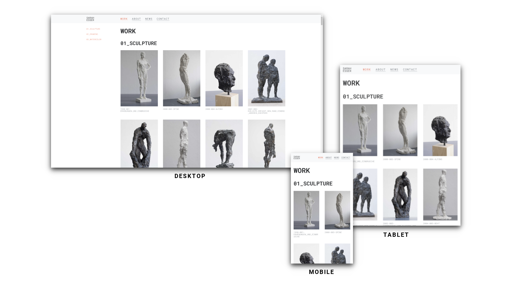
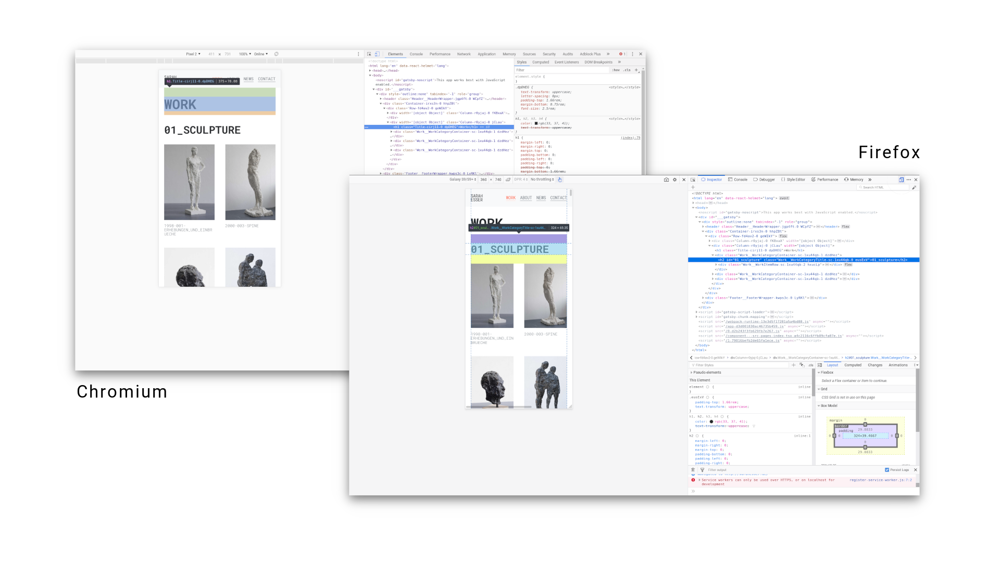
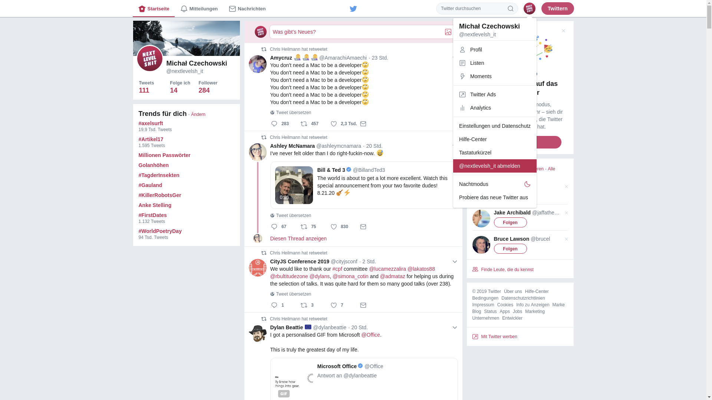

# WCC Session 2

*If you've completed the [Session 1](../WCC-Session-1/#WCC-Session-1) and want to check, whether you've answered the questions correctly, visit the [Solutions for Session 1](../WCC-Session-1/solutions.md).
In the previous session you've learned how to manipulate a web page live and locally during runtime in your browser.
You've heard of important platforms and communities which are important in the daily life of a web developer.*

This *Session 2* will be about [glitches](../WCC-Glossary/#glitches), bad practices and general issues of web pages.
Before we will have a closer look on how to develop a modern website, we should try to learn from general misconceptions of the web.

## General Issues

Maybe you have already noticed that one and the same website sometimes looks different.
Not only on different devices, i.e. screen sizes, as well as on different operating systems, but also in the endless amount of web browsers.
Of course, this is different from the apps on your mobile phone or software that you have to buy and install.
Fonts and colors look different, but content is also arranged differently or even hidden.
In this particular case of different arrangement, we usually speak of [responsive webdesign](../WCC-Glossary/#responsive-webdesign).
This means that a web page adapts to the size of the screen or/and device.
What is clear is that some content no longer fits next to each other, but is arranged one below the other.
Or sometimes even the navigation bar disappears and is hidden behind a so-called [hamburger menu](../WCC-Glossary/#hamburger-menu) and only unfolds when clicked.
So in some cases these are so-called [features](../WCC-Glossary/#feature), i.e. desired behavior, and sometimes called [bugs](../WCC-Glossary/#bug) or glitches, i.e. unwanted side effects.

So for us developers it is the default state that pages are not always [pixel-perfect](../WCC-Glossary/#pixel-perfect) and do not look indistinguishable on any device.
We arrange ourselves with these side effects and could of course, if we had to, invest time and energy for every single browser version, for example, to secure every single unwanted side effect via so-called [workarounds](../WCC-Glossary/#workaround) or [fallbacks](../WCC-Glossary/#fallback), but this is often hardly possible.
Therefore it is often advisable to focus on certain target groups.
For example, you agree on the screen size up to which you want to adjust the page or which browser version you want to address.

What has not yet been mentioned here is [accessibility](../WCC-Glossary/#accessibility-a11y).
In this case one tries to put oneself in the position of people who have restrictions in the visual range or motor skills, i.e. that the pages should then remain usable without a mouse or it is ensured that signal colours are chosen in a spectrum that is also distinguishable for people with red-green weakness.
This is a topic of its own and will be discussed in a later session.

  <small><i>Example of a responsive website on three different screen sizes</i></small>

  

## Glitches

A frequent unintended side effect is a so-called glitch.
Elements are mistakenly displayed too large, too small or no longer at all.
If they are too small, they are no longer readable.
If the objects are too large, they exceed the screen size and the web page can suddenly be scrolled horizontally.
To avoid such glitches it is advisable to test websites on different devices, different screen sizes and different operating systems before publishing them.
As mentioned above, there are also cases where it is intentionally ignored to pay attention to these side effects, because the circle of affected users is too small or too unimportant.
In addition, some features are not supported in some browsers, either because they are too old and [deprecated](../WCC-Glossary/#deprecated), or because they are too modern and not yet supported.

For testing websites and search for that glitches it is recommended to use different devices either or emulate that screen sizes.
Therefore most browser support natively an emulator for common devices like smart phones or tablets.
To test a website, open your [developer tools](../WCC-Glossary/#developer-tools) and find this functionality.
In [Chrome](../WCC-Glossary/#chrome) and [Chromium](../WCC-Glossary/#chromium) it is called *device toolbar*.
In [Firefox](../WCC-Glossary/#firefox) it is called *Responsive Design Mode*.

  <small><i>Device toolbar on Chromium/Chrome and responsive design mode on Firefox</i></small>

  

### Quests

1. Go on any website and find a glitch and make a screenshot of it.
2. When you've found a glitch, try to find out why this happens and write down how to reproduce this glitch for other users.

## Bad Practice

There are two main approaches to responsive web design: Either mobile-first or desktop-first.
Planning and development therefore decides what the primary usage environment will be and abstracts from it what and how will be displayed on the other devices and screen sizes.
Desktop-first would mean that the primary use of the website is from the laptop or desktop computer and vice versa.

What is too often forgotten, however, is that this is not the only building site if you think about making web pages optimally present and usable for the majority of its users.
As already mentioned, a not inconsiderable part of the user community has limitations.
No matter if it is about sensory impressions or motor skills, but also about the personal preferences of users.
Some users prefer to do without *JavaScript*, because all kinds of information about the user can be obtained.
Another example is the well-known *AdBlocker* or similar, which hides unwanted content and advertising on websites.
Others only want to read relevant information and use a read mode for trouble-free reading of articles and other texts.
This is often built into browsers like Safari or Firefox natively.
If you want to go further, you should think about what about languages like Farsi or Arabic, because there texts are read from right to left and not left to right as in English.
Should the whole website be mirrored in order not to hinder the reading flow?

Many larger websites try to avoid and eradicate these barriers, especially in the area of accessibility.
But what is often noticeable is that some popular websites intentionally make certain functionalities difficult to access.
Some functionalities are even intentionally made more difficult in order to stimulate certain user experiences and distract the user from his actual search or task. 
For this purpose, there are research areas that work in full awareness to increase so-called [Key Performance Indicators (KPI)](../WCC-Glossary/#key-performance-indicator-kpi).
This would not be wrong in principle if a company wanted to increase its profits, but not at the expense of [user-friendliness](../WCC-Glossary/#user-friendliness).

All this leads to users getting used to such designs and then not being able to deal with real [usability](../WCC-Glossary/#usability) and [ergonomics](../WCC-Glossary/#egonomics), since user behavior has already adapted.

Finally, there is a even more foundational question of the ethics of the business model of the organisation that creates the product. Is the business model ethical? Or does it rely on violating privacy, a fundamental human right? There is growing awareness of the toxic ramifications of the surveillance-based business model of mainstream Silicon Valley technology on democracy and human rights. Aral Balkan calls this business model “people farming” and Shoshana Zuboff describes the greater socio-economic system that it exists within “surveillance capitalism”. Initiatives like [small technology](https://ar.al/2019/03/04/small-technology/) and the [ethical design manifesto](http://ind.ie/ethical-design) aim to address such concerns.

  <small><i>Twitter „hides“ the logout button in the drop-down menu. Best practice would contain to put that button on the end of the menu.</i></small>

  

### Quests

1. Go on any website you are frequently using and find some bad practices. Often when you are search for anything to long, it is most probably a sign for a bad [User Interface (UI)](../WCC-Glossary/#user-interface-ui).
2. Take a screenshot and make a proposal how to do it better.

