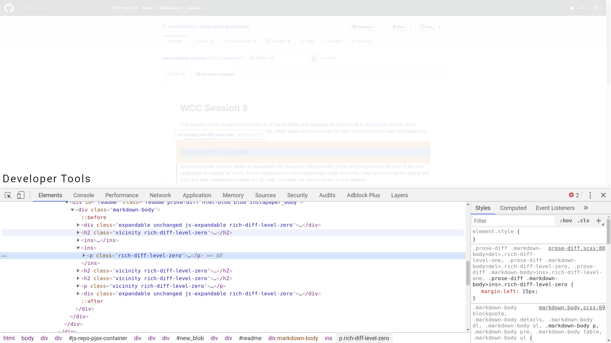
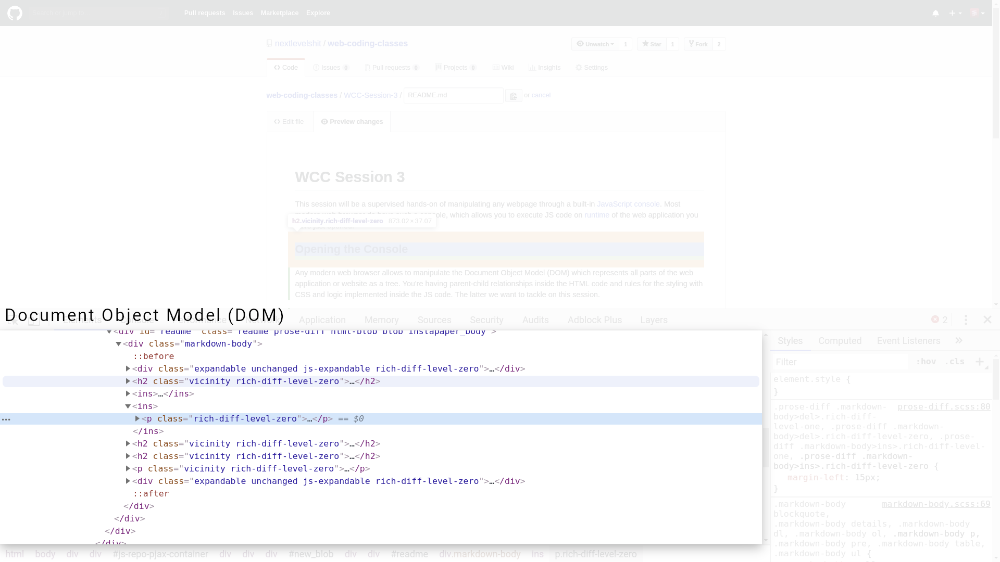
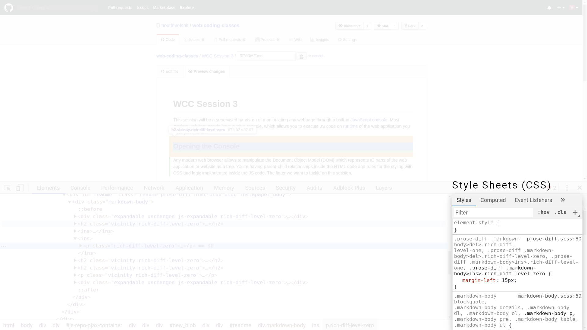
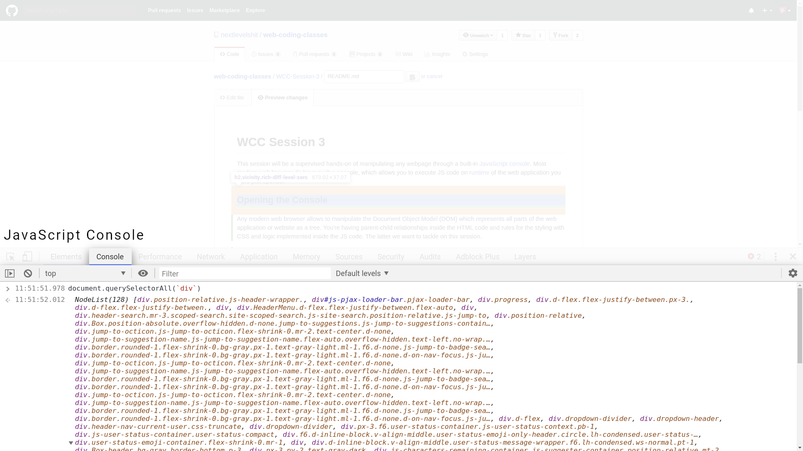

# WCC Session 3

This session will be a supervised hands-on of manipulating any webpage through a built-in [JavaScript](../WCC-Glossary/#javascript-js) [console](../WCC-Glossary/#console).
Most modern web browser do have such a console, which allows you to execute JS code on [runtime](../WCC-Glossary/#runtime) of the web application you have just opened.

## Opening the Developer Tools

Any modern web browser allows to manipulate the Document Object Model (DOM) which represents all parts of the web application or website as a tree.
You're having parent-child relationships inside the HTML code and rules for the styling with CSS and logic implemented inside the JS code.
The latter we want to tackle on this session.

So, open up the [developer mode](../WCC-Glossary#developer-tools) of your browser by hitting <kbd>F12</kbd> on your keyboard or by right-clicking any content and select something like „Inspect element“ (*mind that each browser has a different naming for that interaction*).


<div align="center">
  <small><i>Developer Tools in Chromium Web Browser</i></small>
</div>
<br><br>

## Brief explanation of the Developer Tools

### Document Object Model (DOM)

The so called DOM represents the rendered HTML document.
This is not equal to the source code.
The source code is more or less the basis of your document and top some elements migth change during runtime, e.g. through JS scripts or other programming.
When you've opened the DOM you can hover each element and it will be highlighted inside your view.
This part of the developer tools is mostly useful for analysing the rendered DOM, removing parts or rearranging elements.


<div align="center">
  <small><i>Document Object Model (DOM) in Chromium Web Browser</i></small>
</div>
<br><br>

*Quests:*

1. Open any website and remove elements, that are unnecessary in your point of view.
2. Play around. You cannot do anything wrong. If you've removed accidentally something, just hit <kbd>Ctrl</kbd> + <kbd>Z</kbd> on Windows and Linux or <kbd>Cmd</kbd> + <kbd>Z</kbd> on your Mac.

### Style sheets (CSS)

While having an element highlighted you will find the element-specific stylings.
Styles are mostly attached to the `class` attribute of the HTML element.

```css
.coming-soon {
  position: absolute;
  top: 50%;
  left: 50%;
  transform: translate(-50%, -50%);
  width: 100%;
}
```

The dot in front of the CSS expression indicates that it fits to any element, that has `class="coming-soon"` defined.
These are called *selectors*.

```css
// Element selctor
p {
  color: darkgray;
}
```

```html
<article>
  <h1>Headline</h1>
  <p>Lorem ipsum dolor sit amet ...</p>
</article>
```

The above selector rule or expression will look for any `<p>` tag and adapt its styling, namley to color the text red.

```css
// Class selector
.title {
  color: blueviolet;
  // One line inside the CSS rule indicates an expression
}
// Everything inside the curley brackets indicates the CSS rule
```

```html
<article>
  <h1 class="title">Headline</h1>
  <p>Lorem ipsum dolor sit amet ...</p>
</article>
```

In this case the expression `.title` will look for `class="title"` inside the DOM and color the text in blue violet.

```css
// ID selector
#description {
  color: orangered;
  // │       └─── Indicates the value of the expression
  // │
  // └─────────── Indicates the property of the expression
}
```

```html
<article>
  <h1 class="title">Headline</h1>
  <div id="description">This paragraph describes the article</div>
  <p>Lorem ipsum dolor sit amet ...</p>
</article>
```

Here we are using a different selector. 
Instead of looking for the class or a specific HTML tag, the expression looks for any tag that contains `id="description"`.
You should not use the same ID for different elements.
ID stands for *identifier*  and should uniquely identify an element.
For general rules use `class` with the `.` selector.


<div align="center">
  <small><i>Style Sheets (CSS) in Chromium Web Browser</i></small>
</div>
<br><br>

*Quests:*

1. Open any website and change the style expressions in the developer tools.
2. Also adapt some new rules by clicking inside the expressions, add a new line by hitting <kbd>Return</kbd> and then press <kbd>Ctrl</kbd> + <kbd><Space/kbd>.
   This will open a drop-down menu with possible style properties.
   Choose one, hit <kbd>↹</kbd> to switch into the value field and also hit <kbd>Ctrl</kbd> + <kbd><Space/kbd>.
   Add some stylings and play around.

### The Console (JS)


<div align="center">
  <small><i>JavaScript Console in Chromium Web Browser</i></small>
</div>
<br><br>

## Basic functionality

## DOM Manipulation

`window`

`document`
